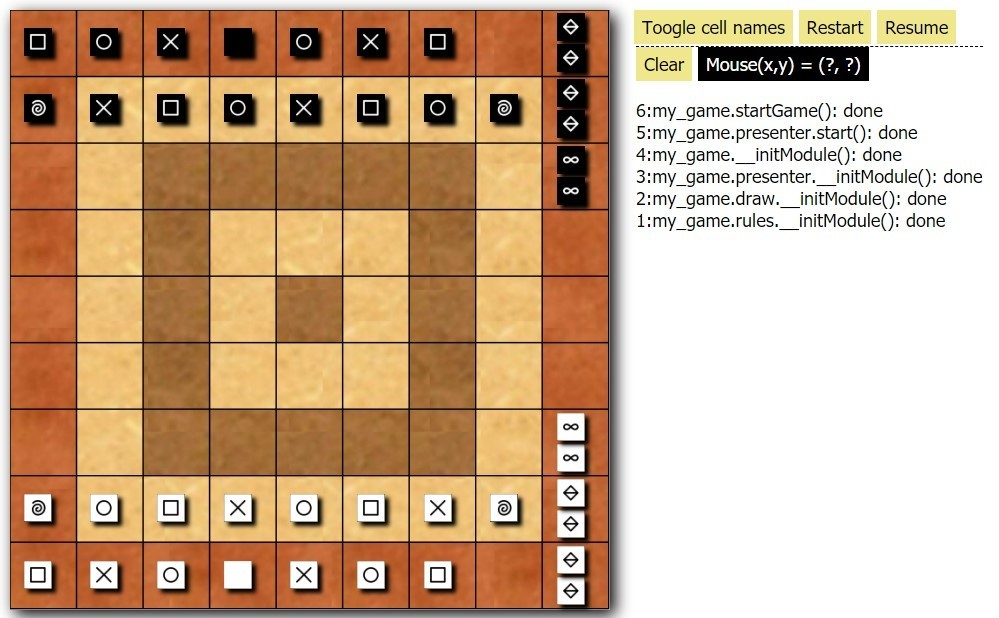

# jersi JS

JERSI-JS is an implementation using Web technologies (Javascript, CSS and HTML) of the rules of the abstract game JERSI.

This project acts as a preparation for the Board Game Arena implementation, at least for the GUI part. Indeed the server side of any Board Game Arena involves additional technologies: PHP and SQL.

If you intent to derive or to sell either a text, a product or a software from this work, then read the [**LICENSE**](./docs/LICENSE.txt) and the  [**COPYRIGHT**](./docs/COPYRIGHT.md)  documents.

Here is an overview of the current GUI. For the exercise, the hexagonal field has been simplified as a rectangular field. 

